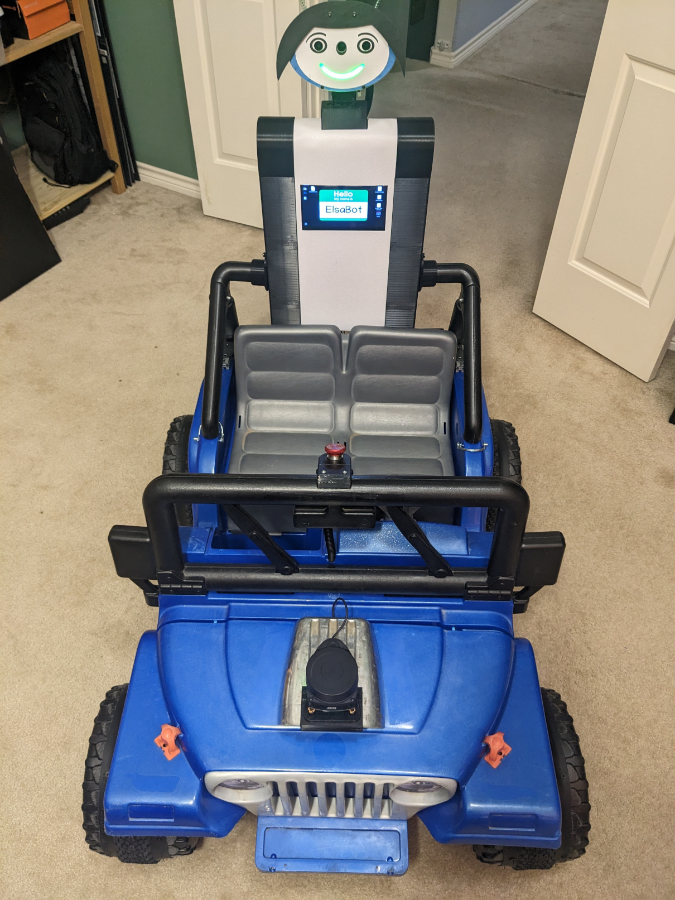
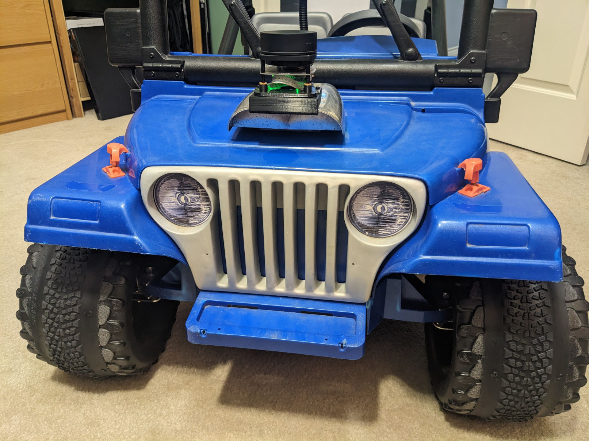
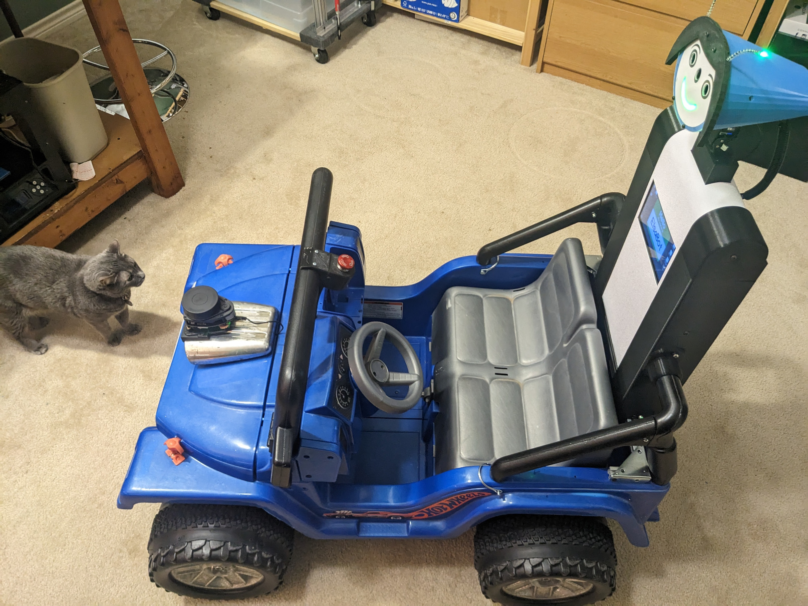
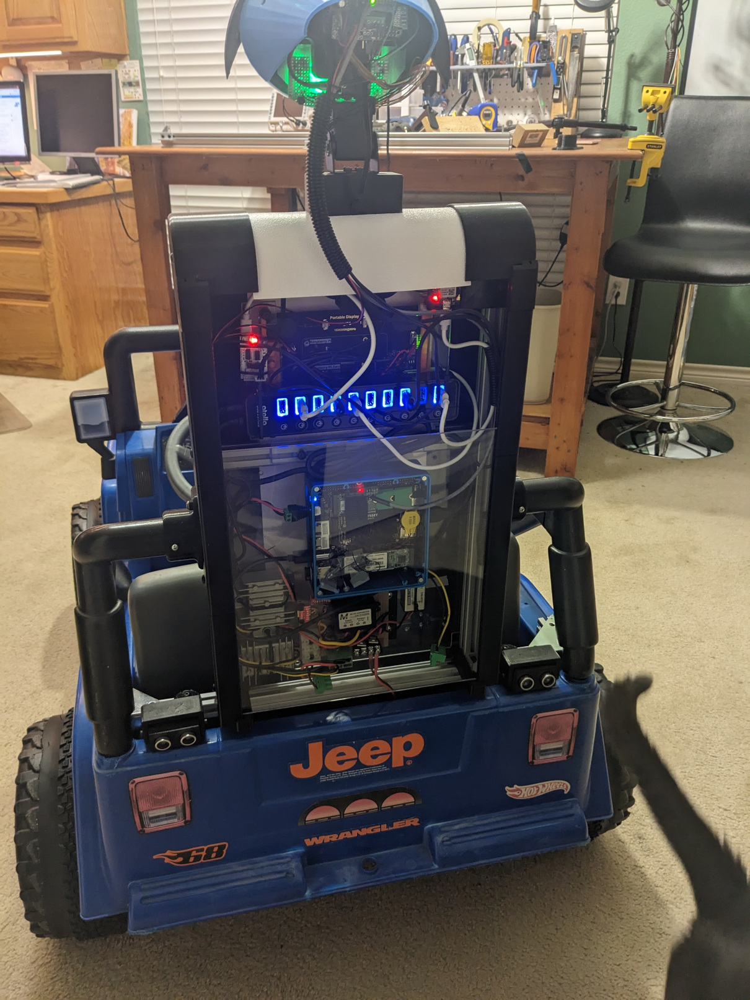
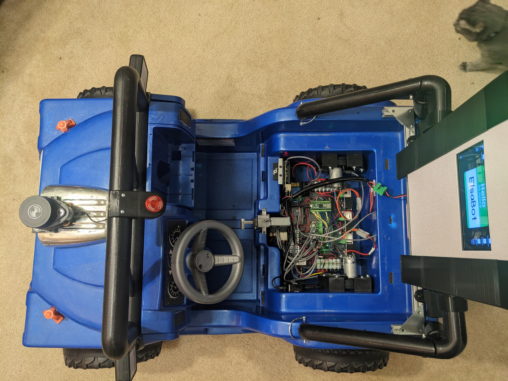
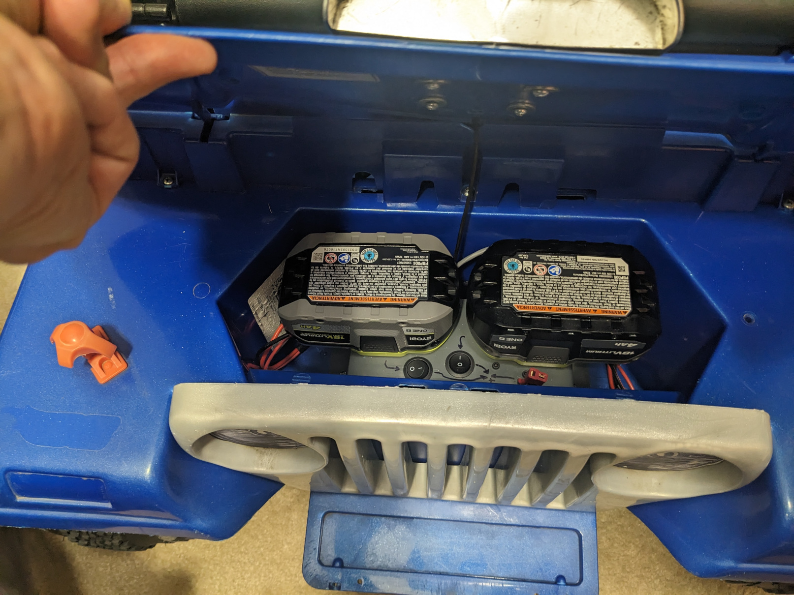

### This is a fork of linorobot2_hardware for the Elsabot PowerWheels Jeep robot base.

See https://github.com/linorobot/linorobot2_hardware for the official readme information for the linorobot2_hardware project.

# Elsabot Jeep

The Elsabot Jeep base:

Phase 1
* Used PowerWheels Jeep chassis
* Existing rear 12V gearbox motors modified with magnets and a Hall sensor for measuring rotational speed
* BTS7960 motor drivers
* Front steering modified to use PowerWheels steering motor.
* Steering shaft cut with encoder mounted to sense steering wheel rotation, and encoder mounted underneath to measure steering rod movement.
* GY85 IMU
* 2-18V Ryobi batteries: 1 for uC and CPU and 1 for powering motors
* 2-INA226 power monitor ICs
* Teensy 4.1 uC
* 4 port USB hub
* Motor power relay controlled by emergency switch, 433 MHz remote controlled relay, and uC
* RPLidar A1
* 2-HCSR04 ultrasonic range sensors (back mounted)
* RPi4
* DC-to-DC converter for control circuitry
* Functionality
  * Game controller control
  * Driver (kid) control
  * ROS Nav2 navigation

Phase 2 (WIP)
* Seeed odyssey j4125 CPU
* OAK-D camera with and pan and tilt servos
* Display panel
* USB speaker
* Seeed ReSpeaker USB Mic Array
* Various DC-to-DC converters
* 10-port USB hub
* GPS
* Functionality
  * Same as phase 1
  * Interactive functionality using Camera AI and voice control (as for previous projects)

Currently using Ubuntu 22.04 and ROS Humble.

See this WIP project for the ROS2 bring-up scripts:
https://github.com/rshorton/elsabot_jeep

YouTube Videos

https://www.youtube.com/shorts/D34mFTZinrc
https://www.youtube.com/watch?v=4h3tpuhNfsM

More pictures

