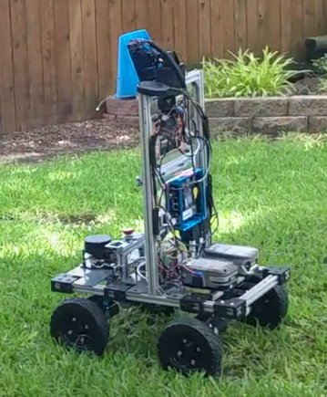

### This is a fork of linorobot2_hardware for the Elsabot 4WD robot base.

See https://github.com/linorobot/linorobot2_hardware for the official readme information for the linorobot2_hardware project.

# Elsabot 4WD

The Elsabot 4WD base:

* 4 wheels using skid steering
* Weelye 24V gearbox motors modified with a Hall sensor for measuring rotational speed
* Lawn mower wheels on 3/8" rod axle
* Frame using 80/20 20mm extrusion with 3d printed connector joints
* Pololu Dual G2 High-Power Motor Driver 18v18
* GY85 IMU
* 2 18V Ryobi batteries: 1 for uC and CPU and 1 for powering motors
* Teensy 4.1 uC
* Seeed odyssey j4125 CPU
* RPLidar A1
* OAK-D camera with and pan and tilt servos
* Display panel
* USB speaker
* Seeed ReSpeaker USB Mic Array
* Various DC-to-DC converters

See this project for the bring-up scripts:

https://github.com/rshorton/elsabot_4wd
