### This is a fork of linorobot2_hardware for the Elsabot Robot base.

See https://github.com/linorobot/linorobot2_hardware for the official readme information for the linorobot2_hardware project.

Dependency (add to firmware/extra_packages directory):
* elsabot_custom_messages - https://github.com/rshorton/elsabot_custom_messages

# Elsabot Robot

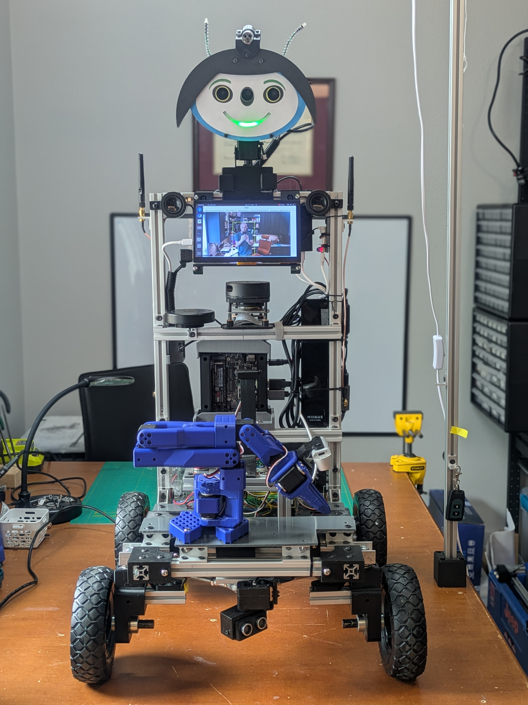

The Elsabot base:

* 4 wheels using Ackermann steering
* Steering motor with lead-screw
* Weelye 24V gearbox motors modified with a Hall sensor for measuring rotational speed
* 6" wheels with rubber tires
* Frame using 80/20 20mm extrusion with 3d printed connector joints
* Pololu Dual G2 High-Power Motor Driver 18v18
* GY85 IMU
* Teensy 4.1 uC
* Nvidia Jetson Orin AGX
* RPLidar A1
* OAK-D camera with and pan and tilt servos
* Display panel
* USB-to-I2C adapter
* Ultrasonic sensors (front and back)
* Seeed ReSpeaker USB Mic Array
* Analog speakers connected thru ReSpeaker Mic array (to leverage AEC)
* Various DC-to-DC converters:
  >* 12-24V to 5V 5A - powers Teensy, Oak-D, misc
  >* 12-40V to 12V 10A - powers USB hub and Jetson
  >* 12-28V to 7.5V 6A - powers servos
* INA226 power monitor - monitors CPU battery
* 10-port powered USB hub
* 433 MHz remote control relay
* Motor power relay
* Schotty diodes for 'wire-oring' external power supply with battery
* 2 18V Ryobi batteries: 1 6Ah for control (uC and CPU), 1 4Ah for powering motors
* 15V 10A power adapter
* Lerobot SO-ARM101 arm with Realsense camera (future support)

See this project for the ROS2 bring-up scripts:

https://github.com/rshorton/elsabot_robot

## Glamour Shots

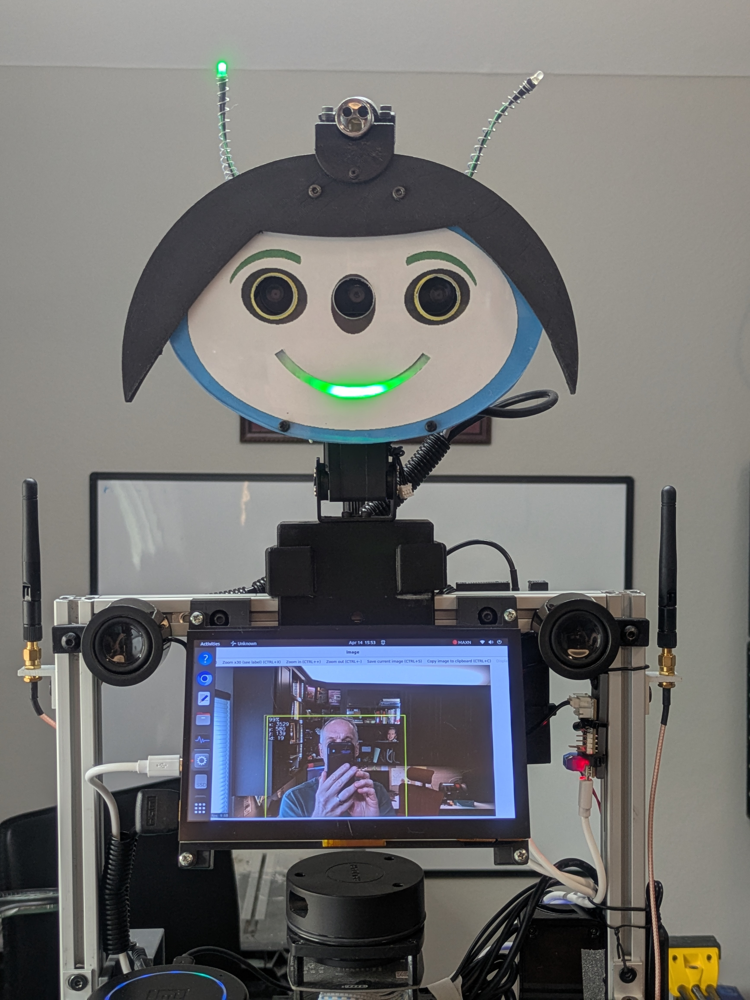
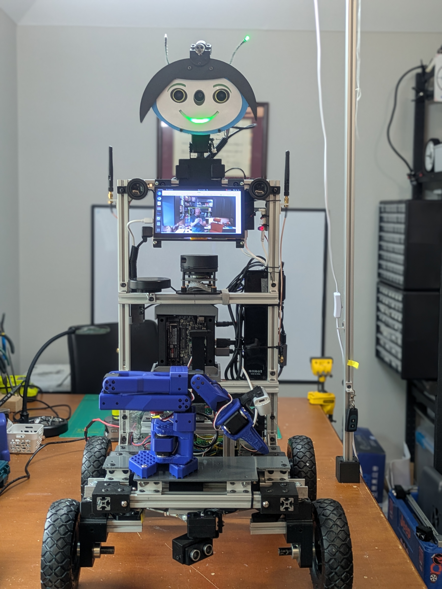
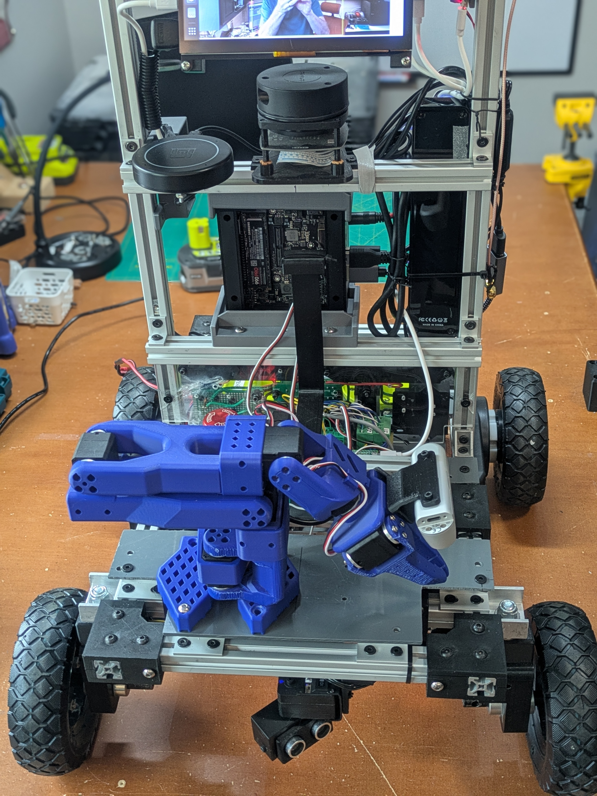
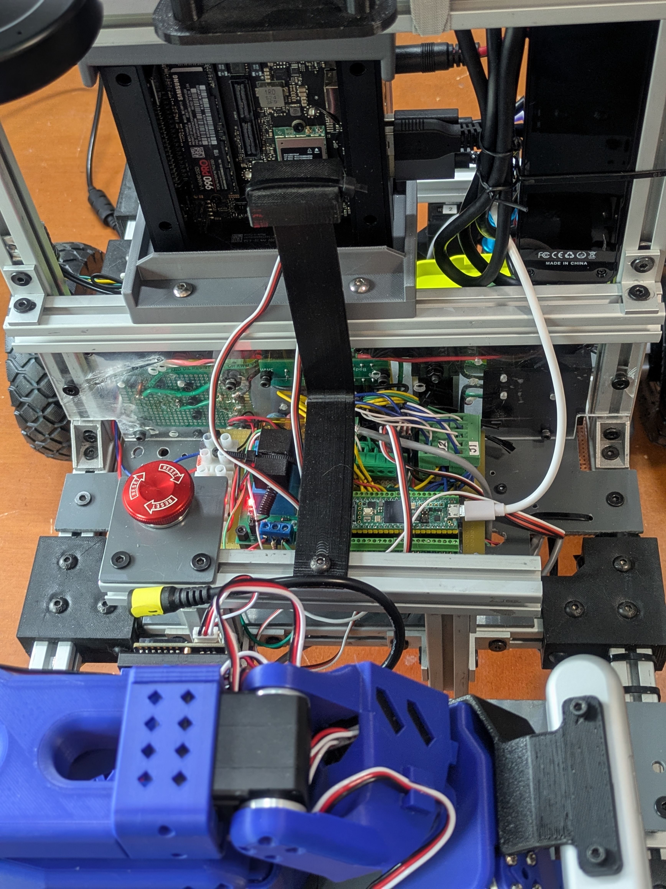
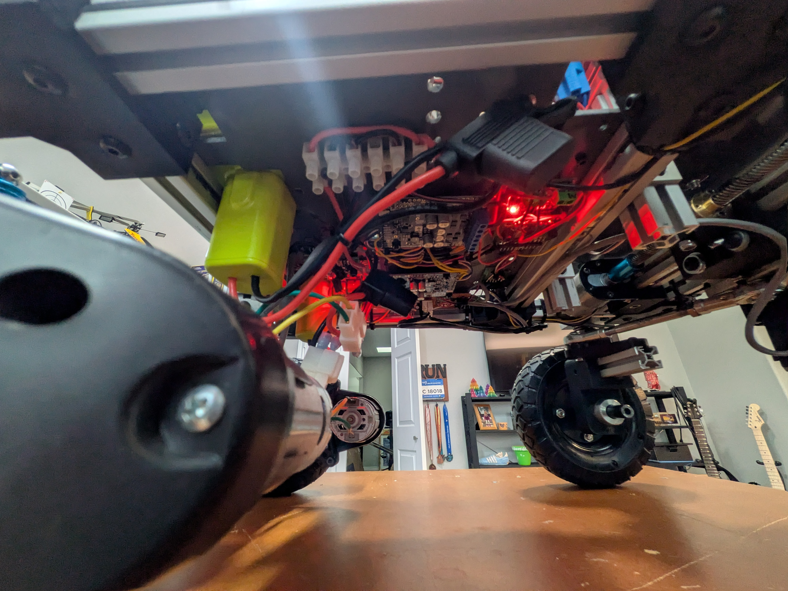
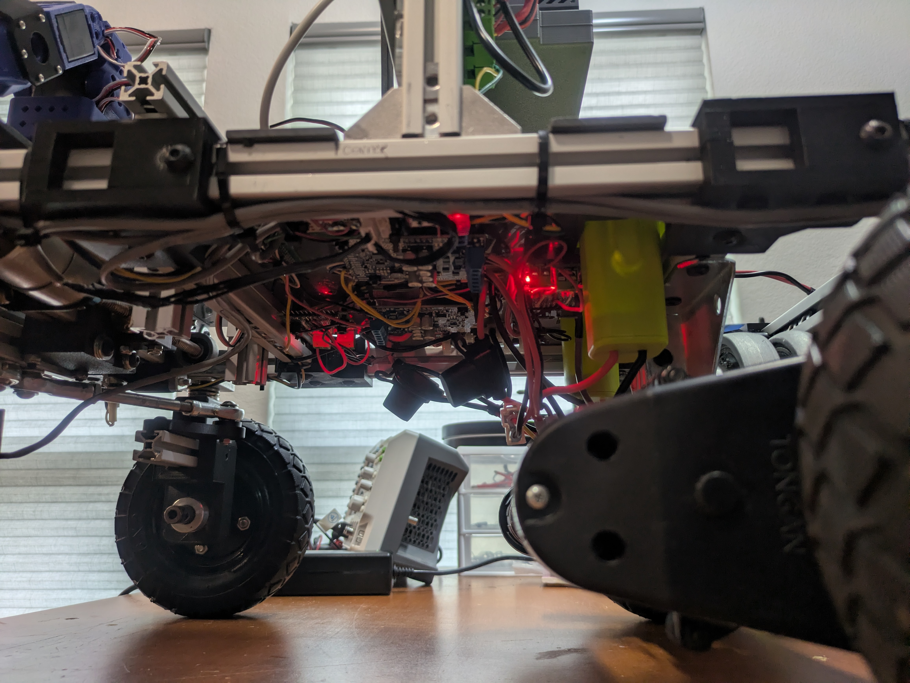
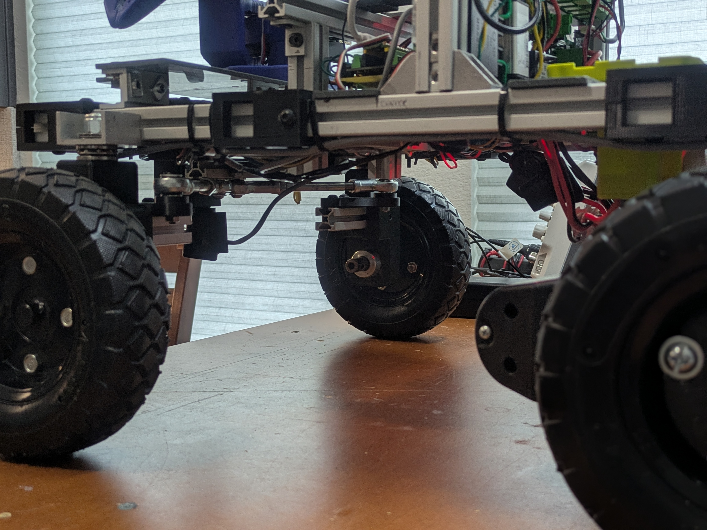
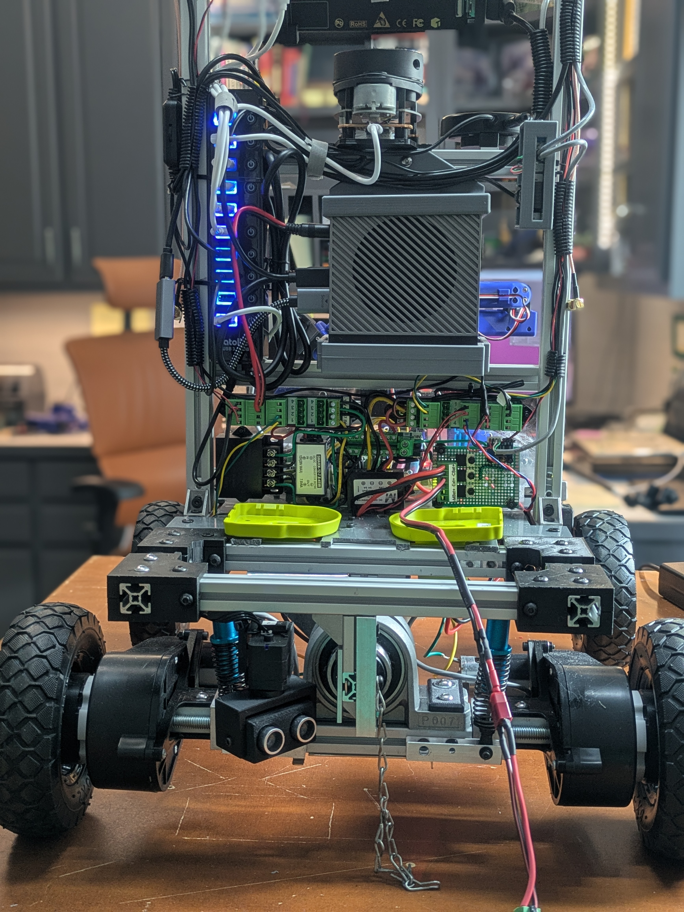
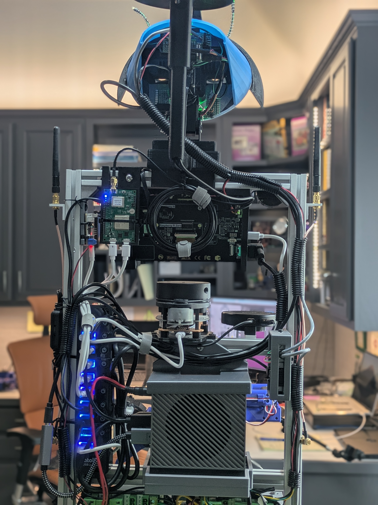
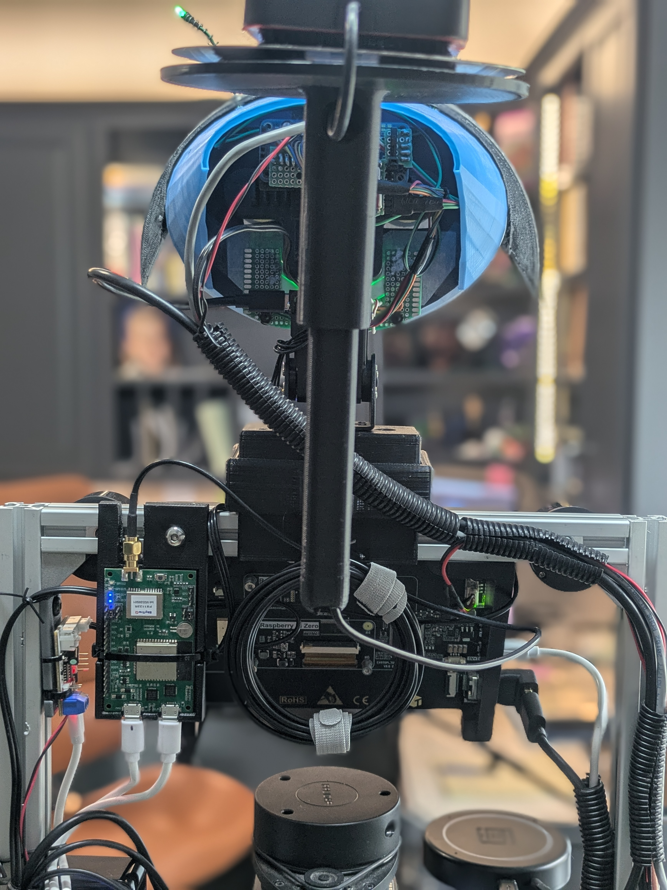
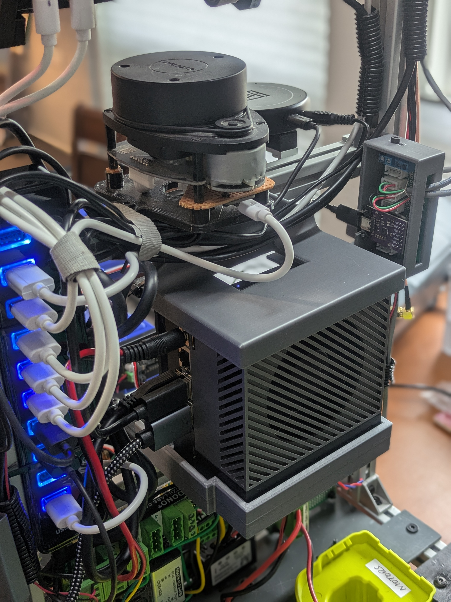
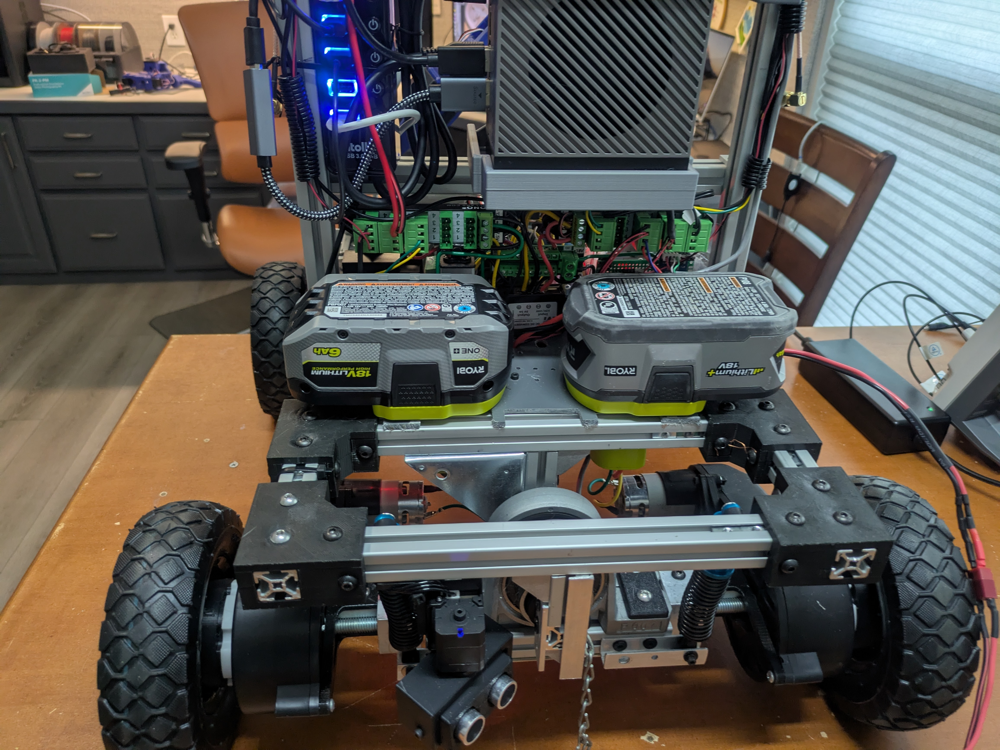
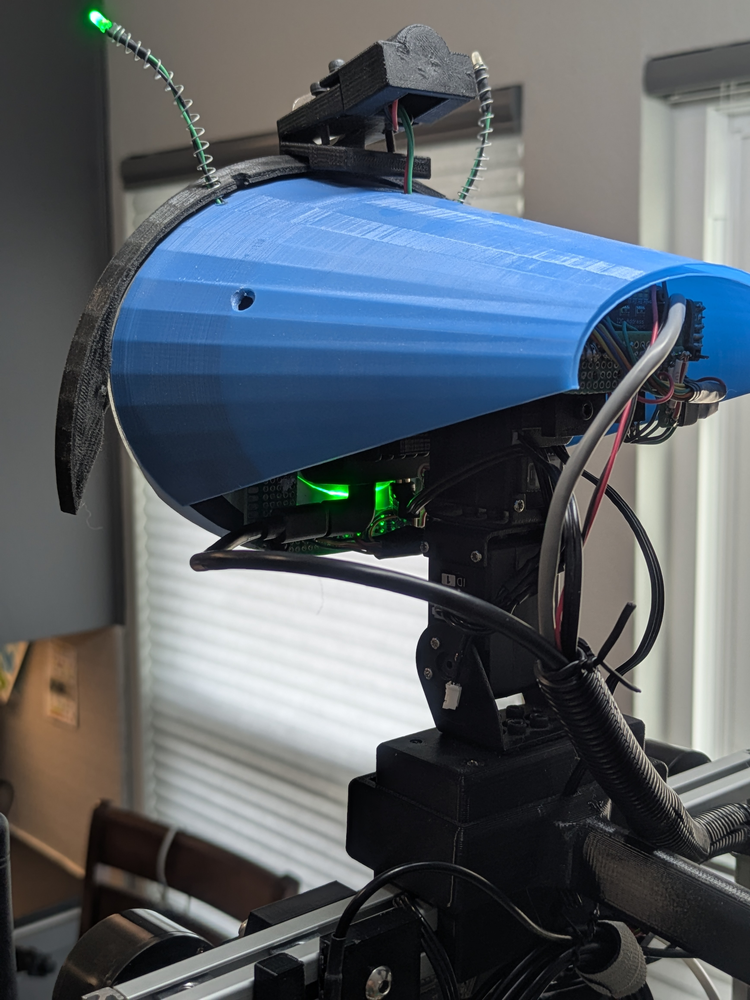